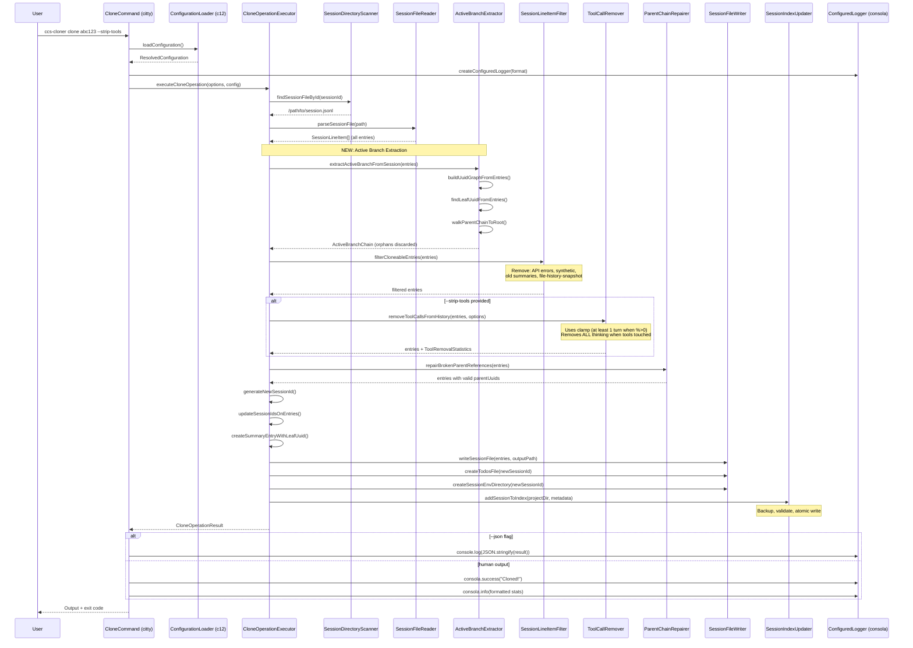

# CCS-Cloner v0.2: UnJS Refactor + Active-Branch-Only Cloning

## Overview

Refactor ccs-cloner with UnJS stack and implement active-branch-only cloning to discard orphaned conversation branches.

## Goals

1. Replace hand-rolled CLI parser with **citty** (fixes arg parsing bugs)
2. Implement **active-branch-only cloning** (walk parentUuid chain, discard orphans)
3. Add **c12** config file support
4. Use **consola** for human/JSON output
5. Use **pathe** for cross-platform paths
6. Fix all known bugs

---

## File Structure

```
ccs-cloner/
├── package.json
├── tsconfig.json
├── ccs-cloner.config.ts              # Example config
├── src/
│   ├── cli.ts                         # Entry: runMain(mainCommand)
│   ├── index.ts                       # SDK exports
│   │
│   ├── commands/
│   │   ├── main-command.ts            # citty main with subCommands
│   │   ├── clone-command.ts
│   │   ├── list-command.ts
│   │   └── info-command.ts
│   │
│   ├── core/
│   │   ├── active-branch-extractor.ts # NEW: Walk parentUuid chain
│   │   ├── session-line-item-filter.ts    # Filter unwanted entries
│   │   ├── tool-call-remover.ts # Tool/thinking removal
│   │   ├── parent-chain-repairer.ts   # Fix broken parentUuid refs
│   │   ├── turn-boundary-calculator.ts # Identify turn boundaries
│   │   └── clone-operation-executor.ts # Orchestrates clone pipeline
│   │
│   ├── io/
│   │   ├── session-file-reader.ts     # Parse JSONL
│   │   ├── session-file-writer.ts     # Write JSONL + sidecars
│   │   ├── session-index-updater.ts   # Update sessions-index.json
│   │   └── session-directory-scanner.ts # Find session files
│   │
│   ├── output/
│   │   ├── clone-result-formatter.ts  # Format results for display
│   │   ├── json-output-reporter.ts    # consola JSON reporter
│   │   └── configured-logger.ts       # consola instance
│   │
│   ├── config/
│   │   ├── configuration-loader.ts    # c12 wrapper
│   │   ├── configuration-schema.ts    # Zod schema
│   │   └── default-configuration.ts   # Defaults + env vars
│   │
│   ├── types/
│   │   ├── session-line-item-types.ts
│   │   ├── active-branch-types.ts
│   │   ├── clone-operation-types.ts
│   │   ├── tool-removal-types.ts
│   │   └── configuration-types.ts
│   │
│   └── errors/
│       └── clone-operation-errors.ts
│
└── test/
    ├── core/
    │   ├── active-branch-extractor.test.ts
    │   └── tool-removal-applicator.test.ts
    ├── io/
    │   └── session-index-updater.test.ts
    └── fixtures/
        ├── branched-session.jsonl
        └── linear-session.jsonl
```

---

## Module Architecture (UML)

```mermaid
classDiagram
    class CloneCommand {
        +run(args) Promise~void~
    }

    class CloneOperationExecutor {
        +executeCloneOperation(options, config) Promise~CloneOperationResult~
    }

    class ActiveBranchExtractor {
        +extractActiveBranchFromSession(entries) ActiveBranchChain
        -buildUuidGraphFromEntries(entries) Map
        -findLeafUuidFromEntries(entries) string
        -walkParentChainToRoot(leafUuid, graph) string[]
    }

    class SessionLineItemFilter {
        +filterCloneableEntries(entries) FilteredEntriesResult
    }

    class ToolCallRemover {
        +removeToolCallsFromHistory(entries, options) ToolRemovalResult
        -calculateTurnBoundaryForRemoval(totalTurns, percentage) number
    }

    class ParentChainRepairer {
        +repairBrokenParentReferences(entries) SessionLineItem[]
    }

    class TurnBoundaryCalculator {
        +identifyTurnBoundaries(entries) TurnBoundary[]
        +isNewUserTurn(entry) boolean
    }

    class SessionFileReader {
        +parseSessionFile(path) Promise~SessionLineItem[]~
    }

    class SessionFileWriter {
        +writeSessionFile(entries, path) Promise~void~
        +createTodosFile(sessionId, claudeDir) Promise~void~
        +createSessionEnvDirectory(sessionId, claudeDir) Promise~void~
    }

    class SessionIndexUpdater {
        +addSessionToIndex(projectDir, sessionId, metadata) Promise~void~
    }

    class SessionDirectoryScanner {
        +findSessionFileById(sessionId, claudeDir) Promise~string~
        +listAllProjects(claudeDir) Promise~string[]~
    }

    class ConfigurationLoader {
        +loadConfiguration() Promise~ResolvedConfiguration~
    }

    class ConfiguredLogger {
        +createConfiguredLogger(format, verbose) ConsolaInstance
    }

    CloneCommand --> CloneOperationExecutor
    CloneCommand --> ConfigurationLoader
    CloneCommand --> ConfiguredLogger

    CloneOperationExecutor --> SessionDirectoryScanner
    CloneOperationExecutor --> SessionFileReader
    CloneOperationExecutor --> ActiveBranchExtractor
    CloneOperationExecutor --> SessionLineItemFilter
    CloneOperationExecutor --> ToolCallRemover
    CloneOperationExecutor --> ParentChainRepairer
    CloneOperationExecutor --> SessionFileWriter
    CloneOperationExecutor --> SessionIndexUpdater

    ToolCallRemover --> TurnBoundaryCalculator
```



---

## Clone Operation Sequence



---

## Key Types

### SessionLineItem
```typescript
interface SessionLineItem {
  type: "user" | "assistant" | "summary" | "file-history-snapshot";
  uuid?: string;
  parentUuid?: string | null;
  sessionId?: string | null;
  timestamp?: string;
  message?: ConversationMessage;
  summary?: string;           // For summary entries
  leafUuid?: string;          // For summary entries
  isApiErrorMessage?: boolean;
  isMeta?: boolean;
}
```

### ActiveBranchChain
```typescript
interface ActiveBranchChain {
  entriesInActiveChain: SessionLineItem[];  // Root to leaf order
  leafNodeUuid: string;
  rootNodeUuid: string;
  extractionStatistics: {
    totalEntriesInFile: number;
    entriesInActiveBranch: number;
    orphanedEntriesDiscarded: number;
  };
}
```

### CloneOperationOptions
```typescript
interface CloneOperationOptions {
  sourceSessionId: string;
  toolRemovalConfig?: {
    toolRemovalPercentage: number;      // 0-100
    truncateRemainingTools: boolean;
    thinkingRemovalPercentage: number;  // Always 100 when tools touched
  };
  outputPathOverride?: string;
  claudeDataDirectory?: string;
}
```

### CloneOperationResult
```typescript
interface CloneOperationResult {
  operationSucceeded: boolean;
  clonedSessionId: string;
  clonedSessionFilePath: string;
  sourceSessionId: string;
  operationStatistics: {
    turnCountOriginal: number;
    turnCountOutput: number;
    toolCallsRemoved: number;
    toolCallsTruncated: number;
    thinkingBlocksRemoved: number;
    orphanedEntriesDiscarded: number;
    fileSizeReductionPercent: number;
  };
}
```

### UserConfiguration (c12)
```typescript
interface UserConfiguration {
  claudeDataDirectory?: string;              // Default: ~/.claude
  defaultToolRemovalPercentage?: number;     // Default: 80
  outputFormat?: "human" | "json";
  verboseOutput?: boolean;
}
```

---

## Key Functions

### Active Branch Extraction
```typescript
// core/active-branch-extractor.ts

function extractActiveBranchFromSession(
  allSessionEntries: SessionLineItem[]
): ActiveBranchChain
// Walk from leafUuid back to root via parentUuid, return only that chain

function buildUuidGraphFromEntries(
  entries: SessionLineItem[]
): Map<string, UuidGraphNode>
// Create lookup map: uuid -> {entry, parentUuid, childUuids}

function findLeafUuidFromEntries(
  entries: SessionLineItem[],
  uuidGraph: Map<string, UuidGraphNode>
): string | null
// Fallback chain: summary.leafUuid (if valid) → latest timestamp leaf → last-in-file leaf

function walkParentChainToRoot(
  leafUuid: string,
  uuidGraph: Map<string, UuidGraphNode>
): string[]
// Return array of uuids from root to leaf
```

### Tool Removal
```typescript
// core/tool-call-remover.ts

function removeToolCallsFromHistory(
  entries: SessionLineItem[],
  options: ResolvedToolRemovalOptions
): { processedEntries: SessionLineItem[]; statistics: ToolRemovalStatistics }

function calculateTurnBoundaryForRemoval(
  totalTurns: number,
  removalPercentage: number
): number
// Uses Math.max(1, Math.floor(...)) when percent > 0 - ensures at least 1 turn affected
```

### Configuration
```typescript
// config/configuration-loader.ts

async function loadConfiguration(): Promise<ResolvedConfiguration>
// Uses c12: searches ccs-cloner.config.ts, .ccs-clonerrc, etc.
```

---

## Bug Fixes

| Bug | Fix |
|-----|-----|
| CLI parsing swallows positional args | Replaced with **citty** |
| `list` sorts after limit | Sort first, then slice |
| Math.floor gives 0 for small counts | Use `Math.max(1, Math.floor(...))` when percent > 0 |
| `--truncate-remaining` works standalone | Require `--strip-tools` |
| Path split on "/" not cross-platform | Use **pathe** |

---

## Behavioral Specifications

### Active Branch Selection (Leaf Node Fallback Chain)

When determining which branch to extract:

1. **Prefer `summary.leafUuid`** if present AND exists in UUID graph
2. **Else:** Find all leaf nodes (entries with no children), pick the one with latest `timestamp`
3. **Else:** Pick last-in-file among leaf nodes

### Config Precedence

```
CLI flags > Environment variables > c12 config file > Defaults
```

### --truncate-remaining Validation

`--truncate-remaining` requires `--strip-tools`. If provided without it, error:
```
Error: --truncate-remaining requires --strip-tools
```

### Output Path Rules

If `--output` points outside the Claude project directory:
- Write the JSONL file to the specified path
- **Skip** sidecars (todos file, session-env directory)
- **Skip** sessions-index.json update

### Test Fixture: branched-session.jsonl

Should contain:
- 10-15 entries total
- 2+ leaf nodes (one active, one orphaned)
- Valid parentUuid chain for active branch
- At least one orphaned branch (3+ entries)
- One summary entry with valid `leafUuid` pointing to active leaf
- Mix of user/assistant entries with tool_use/tool_result blocks

---

## Dependencies

```json
{
  "dependencies": {
    "citty": "^0.2.0",
    "consola": "^3.4.0",
    "pathe": "^2.0.0",
    "c12": "^2.0.0",
    "zod": "^3.24.0"
  }
}
```

---

## Implementation Order

1. **Setup**: Add UnJS deps, create new file structure
2. **Types**: Define all interfaces in `types/`
3. **Core - Active Branch**: Implement `active-branch-extractor.ts` with tests
4. **Core - Migration**: Port filtering, tool removal (with Math.ceil fix), repair
5. **IO**: Migrate file ops using pathe
6. **Config**: Implement c12 loading
7. **Output**: Set up consola with JSON reporter
8. **Commands**: Implement citty commands
9. **Tests**: Integration tests with branched session fixtures
10. **Verification**: Manual test with real sessions

---

## Verification

```bash
# Build
cd /Users/leemoore/code/agent-cli-tools/ccs-cloner
bun install
bun run build

# Test suite
bun test

# Manual test - clone a real session
ccs-cloner clone <session-id> --strip-tools

# Verify in Claude Code
claude --resume  # Should show cloned session
# Resume and verify context shows normal (not "out of context")
```

---

## Critical Files to Modify/Create

- `src/core/active-branch-extractor.ts` - NEW: Core algorithm
- `src/core/clone-operation-executor.ts` - Orchestration with new pipeline
- `src/commands/clone-command.ts` - citty command replacing hand-rolled parser
- `src/config/configuration-loader.ts` - c12 integration
- `test/fixtures/branched-session.jsonl` - Test fixture with multiple branches
